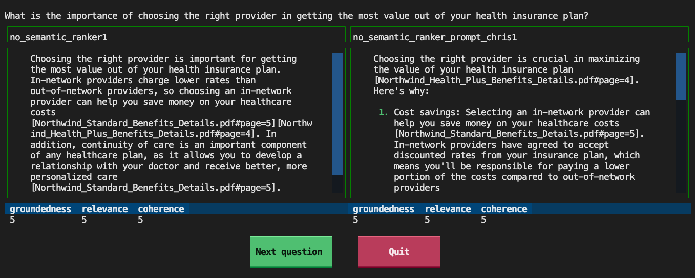

# Evaluating the chat app answers

There are many parameters that affect the quality and style of the answers generated by the chat app,
such as the system prompt, the search service parameters, and the GPT model parameters.

Whenever you are making changes with the goal of improving the answers, we recommend evaluating the results.
We provide a script and tools to make it easier to evaluate any changes, and we also provide examples of evaluations we've run on potential changes in the past.

## Deploying a GPT-4 model

We recommend using GPT-4 for performing the evaluation, even if the app uses GPT-3.5 (as it does by default, currently).
This will be set up for you if you set the `USE_EVALUATION` environment variable to `true`:

```shell
azd env set USE_EVALUATION true
```

Then either run `azd up` if you've never deployed the app before, or run `azd provision` if you've already deployed it.

## Setting up ground truth data

In order to evaluate new answers, we need to compare them to "ground truth" answers: what we consider to be ideal answers for a particular question. We recommend at least 200 QA pairs if possible.

There are a few ways to get this data:

1. Manually curate a set of questions and answers that you consider to be ideal. This is the most accurate, but also the most time-consuming. Make sure your answers include citations in the expected format. This approach requires domain expertise in the data.
2. Use the generator script to generate a set of questions and answers. This is the fastest, but may also be the least accurate. You can call the script like this:

    ```shell
    ./evaluation/generate.sh
    ```

    That script will generate 200 questions and answers, and store them in `evaluator/qa.jsonl`. We've already provided an example based off the sample documents for this app.

3. Use the generator script to generate a set of questions and answers, and then manually curate them, rewriting any answers that are subpar and adding missing citations. This is a good middle ground, and is what we recommend.

## Running an evaluation

We provide a script that loads in the current `azd` environment's variables, installs the requirements for the evaluation, and runs the evaluation against the local app. Run it like this:

```shell
./evaluation/evaluate.sh
```

To change anything about the run, like to override any of the settings to be different from the app defaults, change the parameters at the bottom of `evaluate.py`. It's also possible to run evaluation against a deployed app instead of a local app, if desired.
See the comments in the file for tips on changing the parameters.

http://host.docker.internal:50505/

## Viewing the results

The results of each evaluation are stored in the `results` folder, with a folder for each run. Inside each folder are three files:

- `eval_results.jsonl`: Each question and answer, along with the GPT metrics for each QA pair.
- `parameters.json`: The parameters used for the run, like the overrides.
- `summary.json`: The overall results, like the average GPT metrics.

To make it easier to view and compare results across runs, we've built a  few tools. To use them, you'll need to install the `chatapp-evaltools` package:

```bash
pip install chatapp-evaltools
```

### Using the summary tool

To view a summary across all the runs, use the `summary` command with the path to the results folder:

```bash
chatapp-evaltools summary evaluation/results
```

This will display an interactive table with the results for each run, like this:


To see the parameters used for a particular run, select the folder name.
A modal will appear with the parameters, including any prompt override.

### Using the compare tool

To compare the answers generated for each question across 2 runs, use the `compare` command with 2 paths:

```bash
chatapp-evaltools diff evaluation/results/no_semantic_ranker1 evaluation/results/no_semantic_ranker2
```

This will display each question, one at a time, with the two generated answers in scrollable panes,
and the GPT metrics below each answer.

]

Use the buttons at the bottom to navigate to the next question or quit the tool.
